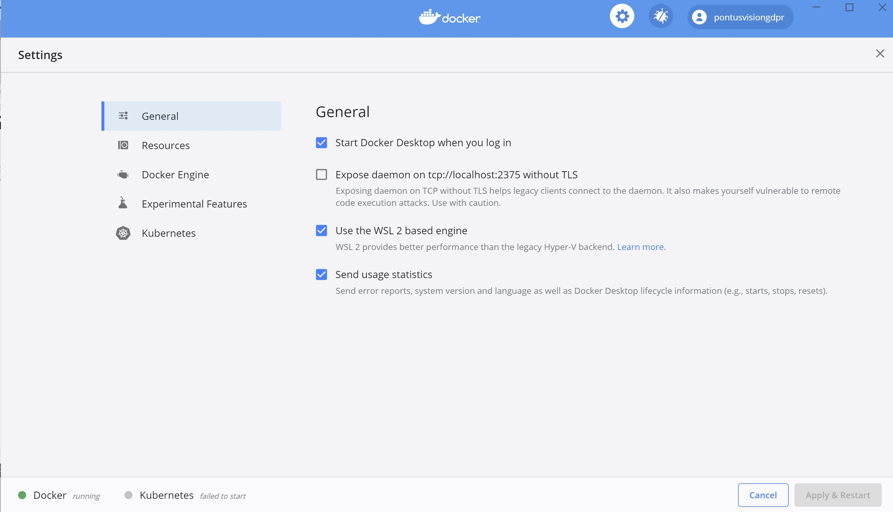
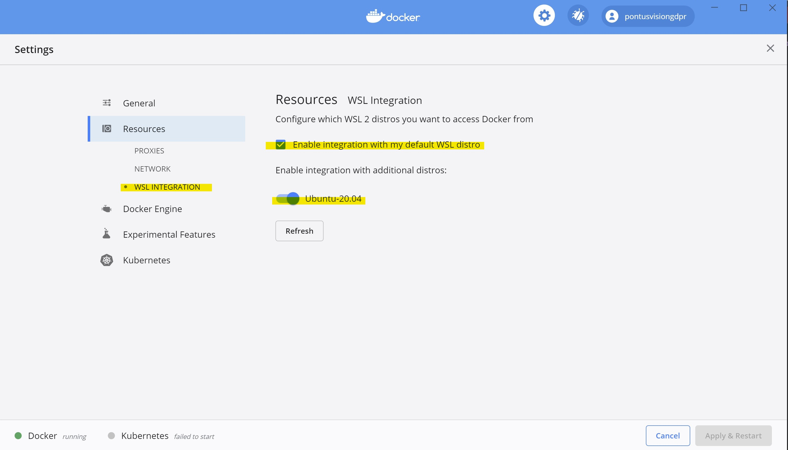
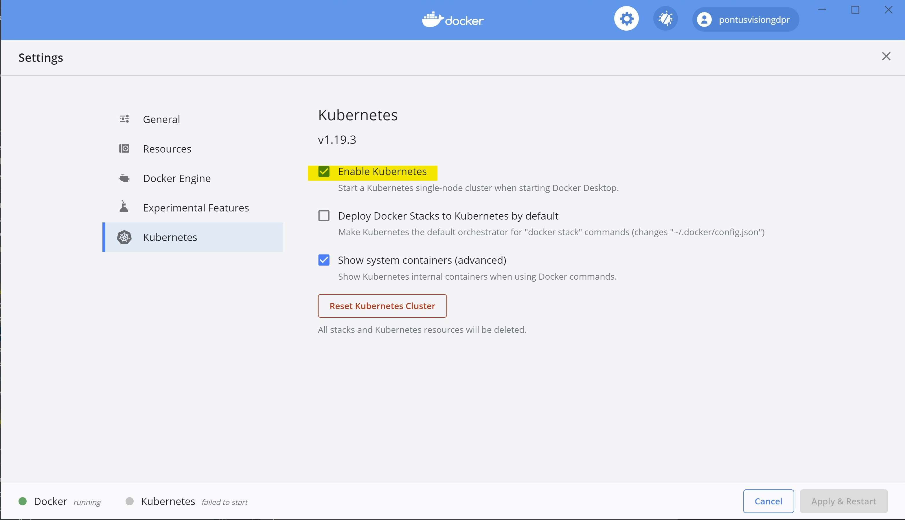

# PontusVision
[Pontus Vision](https://www.pontusvision.com) is an open source platform for data mapping and management of personal data. It helps companies comply with data protection regulations, such as CCPA, LGPD and GDPR.

## Why PontusVision
Pontus Vison has the following benefits:

 * Unstructured and Structured data extraction
 * Compliance Dashboard with the ICO’s 12 Steps
 * Consent Management, including APIs to ensure compliance
 * Graphical or textual reports of all natural persons’ data
 * Real-time reports of all areas with natural person records
 * Data Privacy Impact Accessment (DPIA Management)
 * Data breach Analysis and Reports
 * Custom Forms and Dashboards
 * Can be deployed as a cloud native platform as a service self-hosted solution and/or on-prem.


## Architecture (Modules)

The Pontus Vision platform solves data mapping and management of personal data challenges in 3 modules:


### EXTRACT

Extract Structured Personal Data in Databases, CRM, ERP, and proprietary systems. Also works with unstructured data, such as, emails, PDFs, Word, and Excel.

<details>

The Pontus Vision platform extracts structured and unstructured data in an automated manner and without interference on daily operations. The solution does not require changes to the customers’ systems, being able to receive large volumes of data from several corporate systems. Connectors for systems not yet supported are easily implemented.

Structured Data: Databases, CRM, ERP and proprietary systems.
Unstructured Data: emails, Microsoft Office documents, PDF files, and others.

</details>

### TRACK

Maps all the data from the Extract module, identifying natural persons with as little data as possible, scalable to trillions of records.
<details>

Our solution maps data by tracking all data sources from the Extract stage, identifying customer data with as little information as possible, using graph databases and natural language processing technologies, supporting trillions of records.

Scalability is extremely important as the number of data on natural persons grows daily, with each customer or staff interaction generating new data.

Pontus Vision is based on the POLE (Person, Object, Location, Event) data model to Track data. This is a model used by the UK Government to associate data with individuals. The POLE model creates relationships between People, Objects, Locations and Events, forming the basis of a robust intelligence structure.
</details>


### COMPLY

Gathers links to all personal data within an organization, with graphical or textual reports, using a scoring system based on the ICO’s 12 steps to GDPR compliance.
<details>

All data is consolidated in a dashboard, for graphical or textual visualization.

The solution gathers links to all personal data within an organization, with graphical or textual reports, using a scoring system based on the ICO’s 12 steps to GDPR compliance.

All forms and reports are managed in real time, showing the areas of the organization that have personal data.
</details>


## Architecture (Components)
All Pontus Vision components have been created as docker containers; the following table summarises the key components:


| Docker image                                         |Module   | Description                                     | Stateful            | Image Size | Min Memory |
|------------------------------------------------------|---------|-------------------------------------------------|---------------------|------------|------------|
|  pontusvisiongdpr/grafana                            |Comply   | Dashboard - historical KPIs and data tables     | No                  | 383MiB     | 36.25MiB   |
|  pontusvisiongdpr/pontus-comply-nginx-lgpd:latest    |Comply   | (optional) API Gateway                          | No                  | 183MB      | 4 MiB      |
|  pontusvisiongdpr/pontus-lgpd-formio:latest          |Extract  | (optional) Forms Manager (Brazilian Portuguese) | No                  | 530MB      | 123MiB     |
|  pontusvisiongdpr/pontus-lgpd-formio-mongodb:latest  |Extract  | (optional) Storage for Forms Manager            | Yes                 | 438MB      | 61MiB      |
|  pontusvisiongdpr/pontus-comply-keycloak:latest      |Comply   | (optional) Authenticator - creates JWT token    | Yes                 | 1.21GB     | 437MiB     |
|  pontusvisiongdpr/pontus-track-graphdb-odb-pt:latest |Track    | Graph Database to store data in the POLE model  | Yes                 | 2.27GB     | 5.611GiB   |
|  pontusvisiongdpr/timescaledb:latest                 |Track    | Historical time series database                 | Yes                 | 57.6MB     | 22MiB      |
|  pontusvisiongdpr/postgrest:latest                   |Track    | REST API front end to timescale db              | No                  | 115MB      | 30MiB      |
|  pontusvisiongdpr/pontus-extract-nifi:latest         |Extract  | Workflow tool to convert data to the POLE model | Depends on Workflow | 2.56GB     | 2.805GiB   |
|  jgontrum/spacyapi:all_v2                            |Extract  | (optional) Natural language processor           | No                  | 1.48GB     | 1.186GiB   |


## Getting Started

### Kubernetes
The easiest way to deploy the Pontus Vision platform locally is to start a docker desktop local kubernetes cluster, and follow the instructions below:

#### Pre-requisites:

Hardware: 16GB of memory, 256GB, and 4 cores

Software: Install docker desktop, and enable kubernetes
<details><summary>Windows Instructions</summary>

 * [Install Windows WSL2 Ubuntu 20.04](https://docs.microsoft.com/en-us/windows/wsl/install-win10)
 * [Install Windows Docker desktop](https://docs.docker.com/docker-for-windows/install/) 
 * Enable Kubernetes on Docker Desktop:
   * Use WSL Engine: 
   * Enable WSL2 Integration: 
   * Enable Kubernetes: 

</details> 

<details><summary>MacOS Instructions</summary>
 * [Install MacOS Docker Desktop](https://docs.docker.com/docker-for-mac/install/)
 * Enable Kubernetes: 
</details>

<details><summary>Linux Instructions</summary>
 * [Install Kubernetes](https://ubuntu.com/kubernetes/install)
</details>

#### Steps:

1) run the following commands:
    ```bash
    git clone https://github.com/pontus-vision/pontus-vision.git
    cd pontus-vision/k8s
    ```
1) Follow the instructions [here](k8s/README.md)
1) point a browser to http://localhost:18443/grafana/   (note: DO NOT FORGET the / at the end)
1) Use the user name lmartins@pontusnetworks.com and the default password pa55word


